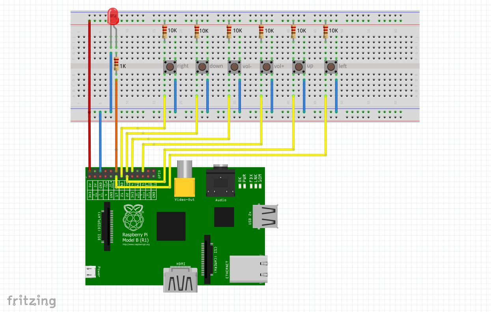

# Book Pie
An audio book reader for vision-disabled people powered by raspberry pi. 

## TO-DO
    - Clean audio assets
    - Add more books
    - Finish to write the readme

## Tools and components

- Raspberry Pi + Cable (Currently using RPi1 version B, but should work with others)
- SD Card + Raspbian installed (install scripts are debian based)
- 6*push buttons
- 6*10Komhs resistors (pull-up)
- 1*1k ohms (led)
- Some wires and a breadboard

## How does it work ?

This audio book reader is meant to be used by someone with sighting impaired, and without an internet connection. Every action inside the software is explained by a voice (only french now, feel free to contribute) and there are 6 buttons is total, which are placed in order to be used without seeing them. When listening, the software saves the current location every 30 seconds.

There are four levels of menu, at each level the button offer new actions, except for vol+ and vol- which operate the global audio volume.

### Main menu

- Button LEFT and RIGHT : Switch between menu options (Resume last book, open book list and need help)
- Button UP: Start the selected menu option
- Button DOWN: Nothing.

### Books list

- Button LEFT and RIGHT : Navigate through the books titles
- Button UP: Open chapters list of the current selected book 
- Button DOWN: Go back to main menu

### Chapters list

- Button LEFT and RIGHT : Navigate through the book chapters
- Button UP: Play the selected chapter
- Button DOWN: Go back to books list

### Player

- Button LEFT and RIGHT : Seek 30s forward or backwards in the chapter
- Button UP: Play/Pause
- Button DOWN: Go back to chapters list

## Circuit

If you want to open the circuit schema as an interactive board, download the Fritzing software and open docs/schema.fzz !
